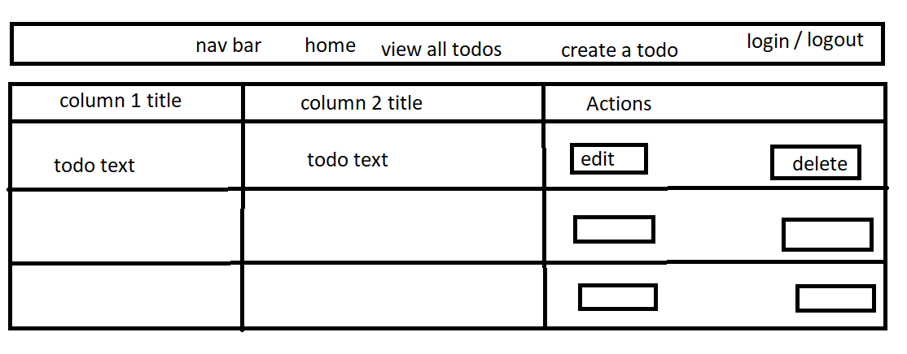
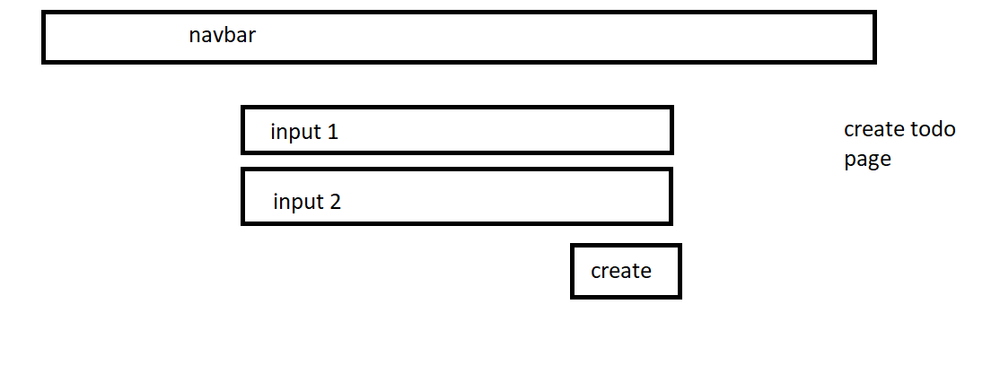

# Minimal Todo List

---
<a href="https://minimal-todos.herokuapp.com/"> Minimal Todo List on Heroku</a>

## Description

A todo list app using MERN stack to perform CRUD functions.

## Technologies Used

- MERN stack

## Project Development

To provide insight of how the application was developed, the following sections are covered:

1. [Project Requirements](#requirements)
2. [User stories](#stories)
3. [Wireframes](#wireframes)
4. [Entity Relationship Diagram](#erd)

**_1. Project Requirements_** 

- MERN stack
- 2 Data models
- CRUD functionalities
- Deployed on Heroku

**_2. User stories_** 

<a href="https://trello.com/b/56XpEI0k/todos"> Trello Board</a>

**_3. Wireframes_** 

<h1>homepage</h1>

<h1>create todo page</h1>

<h1>edit a todo page</h1>

**_3. Entity Relationship Diagram (ERD)_** 

<h1>Models</h1>

## Screen Shots

> **_Landing Page_**

<h1>Landing Page</h1>

> **_Create a Todo_**

<h1>Create a Todo</h1>

> **_Edit a Todo_**

<h1>Edit a Todo</h1>

> **_Populatted List_**

<h1>Populated List</h1>

## Ice Box
properly implement authentication

each user who logs in will only see a todo list associated with their account.

add some pezaz

